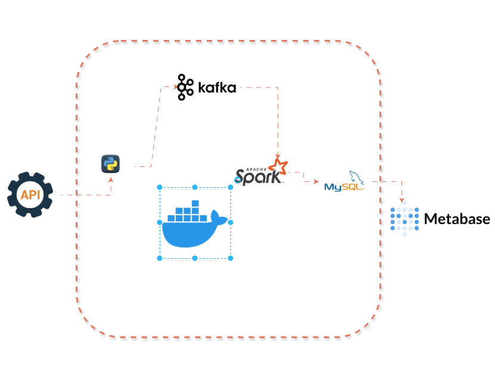

# Real-Time Stock Market Analysis Pipeline

## Business Context

**MarketPulse Analytics** is a leading financial technology firm based in New York City, specializing in real-time market insights for institutional investors. Founded in 2016, MarketPulse provides actionable financial data to hedge funds, asset managers, and electronic brokers across multiple global exchanges.

### The Problem

As data volume and client demand increased, MarketPulse faced three critical pain points:

| Pain Point | Impact |
|---|---|
| **Data Latency** | Delays in integrating data from multiple sources affected accuracy of insights — even a 1 second delay could result in significant financial losses for clients |
| **Scalability** | Existing infrastructure struggled during peak periods (market opens, earnings reports), causing performance bottlenecks |
| **System Reliability** | Lack of robust monitoring made it impossible to detect anomalies in real-time, leading to compliance risks |

### The Solution

This project builds a **scalable, real-time data pipeline** that:
- Streams stock market data with low latency through Apache Kafka
- Processes data in real-time using Apache Spark
- Stores raw and processed data in MySQL
- Delivers actionable insights via interactive Metabase dashboards

### Business Impact

- ⚡ **Faster Decision-Making** — clients can act on financial data instantly
- 📈 **Improved Client Trust** — real-time, transparent data reporting
- 🏆 **Market Leadership** — positions MarketPulse as a leader in high-frequency trading analytics

---

## Project Overview

A real-time data pipeline that extracts live stock data from the Alpha Vantage API, streams it through Apache Kafka, processes it with Apache Spark, stores it in MySQL, and visualizes it with Metabase.

All components are containerized with Docker for easy deployment.

---

## Architecture



---

## Tech Stack

| Tool | Version | Purpose |
|---|---|---|
| Python | 3.11 | Producer & data extraction |
| Apache Kafka | 7.4.10 (KRaft) | Message streaming |
| Apache Spark | 3.5.1 | Real-time data processing |
| MySQL | 8.0 | Data storage |
| Metabase | 0.48.0 | Data visualization |
| Docker | Latest | Containerization |

---

## Project Structure
```
REAL_TIME_STOCK_MARKET_ANALYSIS/
├── src/
│   ├── producer/
│   │   ├── config.py        # API configuration
│   │   ├── extract.py       # Fetches stock data from API
│   │   └── main.py          # Sends data to Kafka
│   └── spark/
│       └── spark_job.py     # Reads from Kafka, processes and writes to MySQL
├── .env                     # Environment variables (API keys, DB credentials)
├── compose.yml              # Docker services configuration
├── Dockerfile               # Producer container
├── Dockerfile.spark         # Spark job container
├── requirements.txt         # Producer dependencies
└── requirements.spark.txt   # Spark dependencies
```

---

## Services

| Service | Port | Description |
|---|---|---|
| Kafka | 9092 | Internal broker |
| Kafka UI | 8085 | Visual Kafka dashboard |
| Spark Master | 8081 | Spark web UI |
| Spark Worker | — | Executes Spark jobs |
| MySQL | 3307 | Database |
| Metabase | 3000 | Visualization dashboard |

---

## Database Tables

### `stocks` — Raw stock data
| Column | Type | Description |
|---|---|---|
| id | VARCHAR(36) | Unique record ID (UUID) |
| symbol | VARCHAR(10) | Stock ticker (TSLA, MSFT, GOOGL) |
| date | DATETIME | Timestamp of the data point |
| open | FLOAT | Opening price |
| high | FLOAT | Highest price |
| low | FLOAT | Lowest price |
| close | FLOAT | Closing price |

### `stock_analytics` — Processed analytics
| Column | Type | Description |
|---|---|---|
| symbol | VARCHAR(10) | Stock ticker |
| avg_open | FLOAT | Average opening price |
| avg_high | FLOAT | Average highest price |
| avg_low | FLOAT | Average lowest price |
| avg_close | FLOAT | Average closing price |

---

## Stocks Tracked

- **TSLA** — Tesla Inc.
- **MSFT** — Microsoft Corporation
- **GOOGL** — Alphabet Inc. (Google)

---

## Getting Started

### Prerequisites
- Docker Desktop installed
- Alpha Vantage API key (via RapidAPI)

### Setup

1. Clone the repository:
```bash
git clone https://github.com/goodness-py/REAL_TIME_STOCK_MARKET_ANALYSIS.git
cd REAL_TIME_STOCK_MARKET_ANALYSIS
```

2. Create a `.env` file in the root directory:
```
API_KEY=your_api_key_here
MYSQL_HOST=db
MYSQL_PORT=3306
MYSQL_DATABASE=stock_db
MYSQL_USER=root
MYSQL_PASSWORD=your_password_here
```

3. Start all services:
```bash
docker compose up --build
```

4. Access the dashboards:
- **Metabase:** http://localhost:3000
- **Kafka UI:** http://localhost:8085
- **Spark UI:** http://localhost:8081

---

## How It Works

1. **Producer** (`main.py`) fetches intraday stock data for TSLA, MSFT and GOOGL from the Alpha Vantage API every run and sends each record as a JSON message to the Kafka topic `stock_topic`.

2. **Kafka** stores the messages in the `stock_topic` topic and makes them available for consumers.

3. **Spark Streaming** (`spark_job.py`) reads messages from Kafka in real-time, parses the JSON, writes raw records to the `stocks` table and calculates average prices per stock symbol and writes them to the `stock_analytics` table.

4. **Metabase** connects to MySQL and visualizes both tables as interactive dashboards.

---

## Key Learnings

- Building a real-time streaming pipeline from scratch
- Separation of concerns — each service has one clear responsibility
- KRaft mode Kafka (no Zookeeper)
- Spark Structured Streaming with `foreachBatch`
- Containerizing multi-service applications with Docker Compose
- Data visualization with Metabase

---

## Future Improvements

- Switch to continuous streaming (currently runs once per execution)
- Add more stock symbols
- Implement price spike alerts
- Migrate to PostgreSQL
- Deploy to cloud (AWS/GCP)
- Implement Star Schema data model

---

## Proposed Star Schema

The current schema uses 2 flat tables. A production-grade implementation would use a **Star Schema** for better performance, scalability and querying.

### Schema Diagram
```
                 dim_stock
                 (TSLA, MSFT, GOOGL)
                      │
                      │ symbol
                      │
dim_date ─── date_id ─┼─── fact_stock_prices ─── time_id ─── dim_time
(dates)               │         (prices)                       (times)
                      │
                      │ symbol
                      │
                 fact_stock_analytics
                    (averages)
```